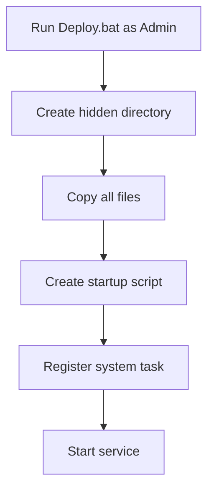
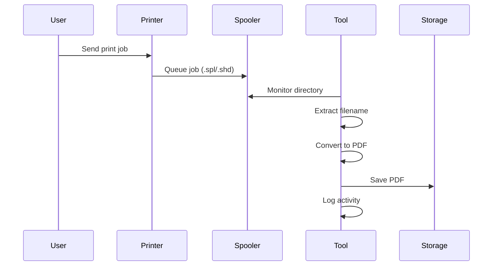

# Stealing-printer-files 🔍📄

> A powerful Windows print job capture and conversion tool that automatically monitors and saves print jobs as PDFs.

[](https://github.com/P-King999/Stealing-printer-files)
[](COPYING.AFPL)
[](https://docs.microsoft.com/en-us/powershell/)

---

## 📖 Table of Contents / 目录

- [Project Introduction / 项目简介](#project-introduction--项目简介)
- [✨ Main Features / 主要功能](#-main-features--主要功能)
- [🛠️ Supported Print Formats / 支持的打印格式](#️-supported-print-formats--支持的打印格式)
- [📁 File Structure / 文件结构](#-file-structure--文件结构)
- [🚀 Installation and Deployment / 安装和部署](#-installation-and-deployment--安装和部署)
- [📋 Usage Instructions / 使用说明](#-usage-instructions--使用说明)
- [⚠️ Precautions / 注意事项](#️-precautions--注意事项)
- [🔧 Technical Details / 技术细节](#-technical-details--技术细节)
- [🔍 Troubleshooting / 故障排除](#-troubleshooting--故障排除)
- [📈 Development Notes / 开发说明](#-development-notes--开发说明)
- [📜 Version History / 版本历史](#-version-history--版本历史)
- [📄 License / 许可证](#-license--许可证)

---

## Project Introduction / 项目简介

### English
Stealing-printer-files is an advanced print job interception and conversion utility designed for Windows environments. This tool silently monitors the system's print spooler directory, captures incoming print jobs in real-time, and automatically converts them into high-quality PDF documents. It supports multiple print data formats and ensures that every print attempt is archived for later review or analysis.

The tool is particularly useful for:
- **Security auditing** - Monitor and log all printing activities
- **Document archiving** - Automatically save print jobs as PDFs
- **Network administration** - Track printing usage across systems
- **Forensic analysis** - Preserve print job data for investigation

### 中文
Stealing-printer-files 是一个高级的打印作业拦截和转换工具，专为 Windows 环境设计。该工具静默监控系统的打印假脱机目录，实时捕获传入的打印作业，并自动将其转换为高质量的 PDF 文档。它支持多种打印数据格式，确保每次打印尝试都被存档以供后续审查或分析。

该工具特别适用于：
- **安全审计** - 监控和记录所有打印活动
- **文档存档** - 自动将打印作业保存为 PDF
- **网络管理** - 跟踪系统间的打印使用情况
- **取证分析** - 保存打印作业数据以供调查

---

## ✨ Main Features / 主要功能

| Feature / 功能 | Description / 描述 |
|---------------|-------------------|
| 🔄 **Automatic Monitoring** | Real-time monitoring of Windows print spooler directory | 实时监控 Windows 打印假脱机目录 |
| 🏷️ **Intelligent Renaming** | Extracts original filenames from print job metadata | 从打印作业元数据中提取原始文件名 |
| 🔄 **Format Conversion** | Converts PCL, PS, and XPS to PDF using Ghostscript | 使用 Ghostscript 将 PCL、PS 和 XPS 转换为 PDF |
| 🔧 **Background Operation** | Runs as a system service with auto-start capability | 作为系统服务运行，具有自动启动功能 |
| 📝 **Comprehensive Logging** | Detailed logs for monitoring and debugging | 详细日志用于监控和调试 |
| 🌐 **Unicode Support** | Full support for international characters in filenames | 对文件名中的国际字符提供全面支持 |
| ⚡ **High Performance** | Efficient processing with minimal system impact | 高效处理，对系统影响最小 |

---

## 🛠️ Supported Print Formats / 支持的打印格式

### Format Matrix / 格式矩阵

| Format / 格式 | Engine / 引擎 | Description / 描述 |
|---------------|---------------|-------------------|
| **PCL** | `gpcl6win64.exe` | Printer Control Language - Common in laser printers | 打印机控制语言 - 激光打印机常用 |
| **PostScript** | `gswin64c.exe` | Adobe PostScript - High-quality graphics | Adobe PostScript - 高质量图形 |
| **XPS** | `gxpswin64.exe` | XML Paper Specification - Microsoft's format | XML 纸张规范 - 微软格式 |

---

## 📁 File Structure / 文件结构

```
Stealing-printer-files/
├── 📄 MasterHijacker.ps1          # Main monitoring script / 主监控脚本
├── 📄 Deploy.bat                  # Deployment script / 部署脚本
├── 🖥️ gswin64c.exe               # Ghostscript for PostScript / PostScript Ghostscript
├── 🖥️ gpcl6win64.exe             # GhostPCL for PCL / PCL GhostPCL
├── 🖥️ gxpswin64.exe              # GhostXPS for XPS / XPS GhostXPS
├── 🔤 *.pxl, *.pcl, *.xps        # Font files / 字体文件
├── 📄 看我.txt                    # Instructions / 说明
├── 📄 README.md                   # This file / 本文件
├── 📄 COPYING.AFPL                # License / 许可证
└── 📁 Backups/                    # Generated PDFs / 生成的 PDF (运行后)
    └── 📄 convert.log             # Log file / 日志文件
```

---

## 🚀 Installation and Deployment / 安装和部署

### Quick Start / 快速开始

1. **Download / 下载**: Clone or download the repository
   ```bash
   git clone https://github.com/P-King999/Stealing-printer-files.git
   ```

2. **Deploy / 部署**: Run as administrator
   ```cmd
   Deploy.bat
   ```

3. **Verify / 验证**: Check system tasks
   ```cmd
   schtasks /query /tn "WinPrintServiceUpdate"
   ```

### Detailed Steps / 详细步骤

#### Step 1: Prerequisites / 前提条件
- Windows 10/11 with PowerShell 5.1+
- Administrator privileges
- Internet connection for initial setup

#### Step 2: Deployment / 部署


#### Step 3: Verification / 验证
- Service runs automatically on login
- Monitor `convert.log` for activity
- PDFs saved to `D:\ProgramDate\appcompat\print\Backups\`

---

## 📋 Usage Instructions / 使用说明

### How It Works / 工作原理



### Workflow / 工作流程

1. **Detection / 检测**: Tool detects new `.spl` and `.shd` files in spooler
2. **Extraction / 提取**: Parses SHD file for original document name
3. **Conversion / 转换**: Uses appropriate Ghostscript engine for conversion
4. **Storage / 存储**: Saves PDF with timestamp to backup directory
5. **Cleanup / 清理**: Removes temporary files, logs success

### Example Output / 示例输出

```
D:\ProgramDate\appcompat\print\Backups\
├── Report-20240319-143022.pdf
├── Document-20240319-143500.pdf
└── convert.log
```

---

## ⚠️ Precautions / 注意事项

### Security Considerations / 安全注意事项

- 🔒 **Permissions**: Requires admin rights for installation
- 🔐 **Data Privacy**: Captures all print data - ensure compliance
- 🛡️ **Network Security**: Monitor for unauthorized access
- 📊 **Storage**: Large print jobs may consume significant disk space

### System Requirements / 系统要求

| Component / 组件 | Minimum / 最低 | Recommended / 推荐 |
|------------------|---------------|-------------------|
| OS / 操作系统 | Windows 10 | Windows 11 |
| RAM / 内存 | 4GB | 8GB+ |
| Disk / 磁盘 | 1GB free | 10GB+ free |
| CPU / 处理器 | x64 | Multi-core |

### Known Limitations / 已知限制

- Only captures jobs sent to local spooler
- Requires Ghostscript executables
- May not work with all printer drivers
- Unicode filenames may have encoding issues

---

## 🔧 Technical Details / 技术细节

### Architecture / 架构

```powershell
# Core monitoring loop
while($true) {
    $jobs = Get-ChildItem $WatchPath -Filter *.shd
    foreach ($job in $jobs) {
        if (!$ProcessedJobs.ContainsKey($job.BaseName)) {
            Convert-Task $job
            $ProcessedJobs[$job.BaseName] = $true
        }
    }
    Start-Sleep -Milliseconds 800
}
```

### Key Components / 关键组件

- **File Monitor**: Uses PowerShell `Get-ChildItem` for directory watching
- **Parser**: Regex-based extraction from binary SHD files
- **Converter**: Command-line invocation of Ghostscript tools
- **Logger**: UTF-8 encoded log file with timestamps

### Performance Metrics / 性能指标

- **Detection Time**: < 1 second for new jobs
- **Conversion Speed**: ~2-5 seconds per page (depends on complexity)
- **Memory Usage**: ~50MB baseline + per-job overhead
- **CPU Usage**: Minimal when idle, spikes during conversion

---

## 🔍 Troubleshooting / 故障排除

### Common Issues / 常见问题

#### Issue 1: Service Not Starting / 服务未启动
**Symptoms**: No log file created, no PDFs generated
**Solution**:
```cmd
# Check task status
schtasks /query /tn "WinPrintServiceUpdate"

# Re-run deployment
Deploy.bat
```

#### Issue 2: Conversion Failures / 转换失败
**Symptoms**: PDFs not created, errors in log
**Check**:
- Verify Ghostscript executables exist
- Check file permissions on backup directory
- Ensure print format is supported

#### Issue 3: Missing Fonts / 字体缺失
**Symptoms**: Poor PDF quality, missing characters
**Solution**: Ensure all `.pxl`, `.pcl`, `.xps` files are present

### Log Analysis / 日志分析

```
[SUCCESS] Captured: Report.docx -> Report-143022.pdf
[FATAL] Conversion failed for job_123: Engine not found
[INFO] Service started, monitoring active
```

### Debug Mode / 调试模式

Enable verbose logging by modifying `MasterHijacker.ps1`:
```powershell
$VerbosePreference = "Continue"
```

---

## 📈 Development Notes / 开发说明

### Building from Source / 从源码构建

1. Clone repository
2. Ensure PowerShell execution policy allows scripts
3. Test on development machine before deployment

### Contributing / 贡献

1. Fork the repository
2. Create feature branch
3. Submit pull request

### Future Enhancements / 未来增强

- [ ] Support for additional formats (PDF direct, etc.)
- [ ] Web interface for job management
- [ ] Cloud storage integration
- [ ] Advanced filtering options
- [ ] Multi-language support

---

## 📜 Version History / 版本历史

### v1.0.0 (2024-03-19)
- ✅ Initial release
- ✅ PCL, PostScript, XPS support
- ✅ Intelligent filename extraction
- ✅ Background service deployment
- ✅ Comprehensive logging

### Roadmap / 路线图

- **v1.1.0**: Enhanced error handling, performance optimizations
- **v1.2.0**: Web dashboard, job filtering
- **v2.0.0**: Cross-platform support, cloud integration

---

## 📄 License / 许可证

This project is licensed under the Aladdin Free Public License (AFPL).
See [COPYING.AFPL](COPYING.AFPL) for full license text.

---

## 🤝 Support / 支持

- 📧 **Issues**: [GitHub Issues](https://github.com/P-King999/Stealing-printer-files/issues)
- 📖 **Documentation**: This README
- 🆘 **Help**: Check logs and troubleshooting section

---

*Made with ❤️ for Windows print job management / 为 Windows 打印作业管理而生*